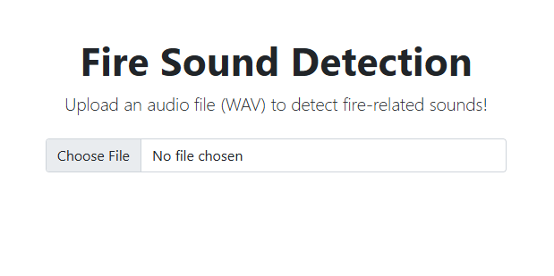
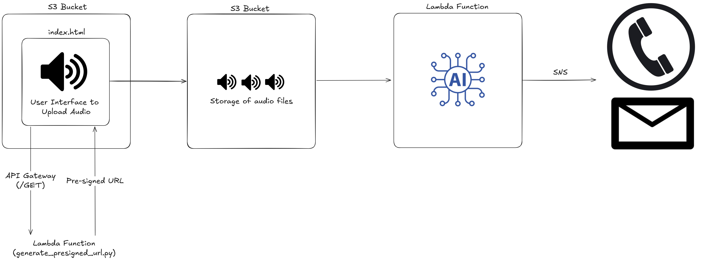

# Smart Fire Alerts

A prototype solution using AI, Python, and AWS to detect fire-related audio events and send real-time alerts to improve public safety.

---

## Problem Statement

According to the National Fire Protection Association (NFPA), nearly three out of five home fire deaths occur in properties without working smoke alarms, or where alarms go unheard. In many residential settings, especially those with elderly residents, individuals with disabilities, or those who are away from home, traditional fire alarms may sound but fail to alert anyone. This delay in emergency response significantly increases the risk of injury, death, and property loss.

Traditional smoke alarms are loud, but they’re not always smart. They often can't escalate the alert if no one reacts. Most smart home systems don’t verify whether an alarm was acknowledged, or notify emergency contacts when something goes wrong. That leaves people vulnerable when every second counts. That's where Smart Fire Alerts comes into play.

---

## Solution Overview

This project implements an AI-powered fire sound detection system that enables users to upload .wav audio files for analysis. The system uses a pre-trained sound classification model (YAMNet from TensorFlow Hub) to process the uploaded audio and identify fire-related sounds, such as fire alarms, smoke detectors, sirens, and other emergency signals. When a fire-related sound is detected, the system sends an immediate SMS alert and publishes a notification to an Amazon SNS topic, simulating a rapid emergency response.

> This is a prototype meant for local testing. All AWS services are in place, but you’re not expected to deploy them yourself.

---

## AI Component

- **Model**: [YAMNet](https://tfhub.dev/google/yamnet/1) from TensorFlow Hub — a deep net that predicts audio event classes from the AudioSet dataset.
- **Detection Logic**: After scoring an audio file, the system checks if any of the top 5 predicted classes include fire-related keywords: `fire`, `smoke alarm`, `fire alarm`, `siren`, `alarm`, or `smoke detector`.

---

## Python Implementation

- `lambda_function.py`: Main inference function loaded into a Dockerized AWS Lambda. It:
  - Downloads audio from S3.
  - Resamples and processes audio.
  - Runs inference with YAMNet.
  - Publishes an alert to an SNS topic and sends an SMS.

- `generate_presigned_url.py`: Generates a pre-signed S3 URL so that users can upload audio securely from the frontend.

---

## 📸 Example Screenshots

To give a better sense of how the system behaves in action, here are a few example screenshots:

- The frontend interface for uploading audio files
- Email notifications triggered by fire vs. non-fire sounds

| Fire Sound Detected | No Fire Sound Detected | Frontend |
|:-------------------:|:----------------------:|:--------:|
|  |  |  |

---

## Web Architecture (AWS)



**AWS Services Used**:
- **S3**: Stores uploaded audio files, class map, and hosts the static `index.html` frontend.
- **Lambda**: 
  - Audio classification handler triggered by S3 `ObjectCreated` events.
  - Generates pre-signed URLs for secure file uploads from the frontend.
- **API Gateway**: Exposes an endpoint for requesting pre-signed URLs
- **SNS**: Sends alerts via SMS and SNS topics.
- **SSM Parameter Store**: Stores secure config values.


---

## Local Setup Instructions

You can test the AI locally without using any AWS resources. There’s a basic Python + HTML/JS interface for uploading files and viewing detection results.

### Requirements

- Python 3.8+
- Install required packages:

```bash
pip install -r requirements.txt
```

### How to Run

From the `local-setup` directory:

1. Install the dependencies:

    ```bash
    pip install flask tensorflow tensorflow_hub scipy
    ```

2. Start the Flask app:

    ```bash
    python app.py
    ```

3. Open your browser to `http://localhost:5000`.

4. Upload a `.wav` file with a fire alarm sound (There are sample audio files under the test_audio folder).

You’ll see a result like:

- ✅ **No fire-related sounds detected.**
- 🚨 **Fire alarm sound detected!**

---

If you have any questions or feedback, feel free to reach out to me:

- **LinkedIn**: [https://www.linkedin.com/in/nicolas--nguyen/](https://www.linkedin.com/in/nicolas--nguyen/)
